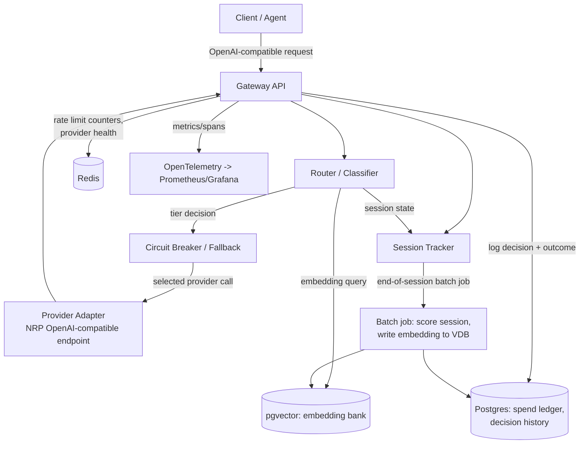
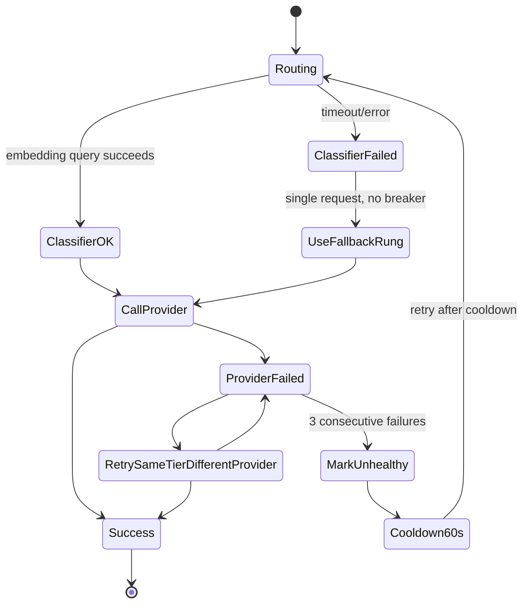

# Cost-Aware LLM Gateway — Architecture Spec (v0.2)

> v0.2 (2026-09-04) moved every provider tier onto NRP-hosted open-weights
> models and reconciled this document with the implementation. The wide
> model ladder that replaces the three-tier scheme is designed in
> `docs/specs/2026-09-04-wide-ladder-design.md`; this spec describes the
> system as built.

## 1. Goal

Build a proxy gateway that sits in front of multiple LLM providers and routes each
request to the cheapest model tier likely to produce an acceptable result, using
embedding-similarity matching against a growing bank of past requests and
session-level difficulty signals — rather than static per-request rules.

**North star metric:** effectiveness / cost, measured against a benchmark suite,
with an explicit budget-vs-quality tradeoff report as the demo artifact.

Non-goals (v0.1): multi-region deployment, enterprise SSO/RBAC, streaming
response normalization across providers (LiteLLM already solved this well —
reuse rather than rebuild if needed).

---

## 2. High-Level Architecture



---

## 3. Components

| Component                  | Responsibility                                                                                                                                            | Backing store                            |
| -------------------------- | --------------------------------------------------------------------------------------------------------------------------------------------------------- | ---------------------------------------- |
| Gateway API                | OpenAI-compatible entrypoint, request/response logging                                                                                                    | —                                        |
| Session Tracker            | Detects session boundaries via task keywords; tracks turn count, elapsed time                                                                             | Redis (live), Postgres (closed sessions) |
| Router / Classifier        | Embeds incoming request, queries nearest neighbors in pgvector, applies threshold (shifted by session state) to pick a tier                               | pgvector                                 |
| Circuit Breaker / Fallback | Handles classifier failure (→ the fallback rung, single request) and provider failure (→ retry same tier, different provider; 3 consecutive failures → 60s cooldown) | Redis                                    |
| Provider Adapters          | Thin litellm wrapper over NRP's single OpenAI-compatible endpoint; tier -> model list + parameter-count cost proxy                                       | —                                        |
| Spend Ledger               | Per-team budget, usage, running average session difficulty                                                                                                | Postgres                                 |
| Decision History           | Every routing decision + eventual outcome, feeds the embedding bank                                                                                       | Postgres + pgvector                      |
| Batch Feedback Job         | Runs at session end: scores session quality, writes new embedding + outcome to bank                                                                       | —                                        |
| Eval Harness               | Runs benchmark suite against the live router, computes effectiveness/cost                                                                                 | Separate offline tool                    |

---

## 4. Data Model

### `spend_ledger`

```sql
CREATE TABLE spend_ledger (
    team_id UUID PRIMARY KEY,
    budget_cents INTEGER NOT NULL,
    usage_cents INTEGER NOT NULL DEFAULT 0,
    avg_session_difficulty FLOAT DEFAULT NULL,
    updated_at TIMESTAMPTZ DEFAULT now()
);
```

### `sessions`

```sql
CREATE TABLE sessions (
    session_id UUID PRIMARY KEY,
    team_id UUID REFERENCES spend_ledger(team_id),
    task_keywords TEXT[],
    started_at TIMESTAMPTZ DEFAULT now(),
    ended_at TIMESTAMPTZ,
    turn_count INTEGER DEFAULT 0,
    expected_turn_count INTEGER,       -- from benchmark difficulty label, if known
    quality_score FLOAT,               -- computed at session close
    current_threshold FLOAT DEFAULT 0.5 -- shifted live during the session
);
```

### `decision_history`

```sql
CREATE EXTENSION IF NOT EXISTS vector;

CREATE TABLE decision_history (
    routing_id UUID PRIMARY KEY,
    session_id UUID REFERENCES sessions(session_id),
    model_id TEXT NOT NULL,
    calculated_difficulty FLOAT,
    calculated_effectiveness FLOAT,     -- filled in after outcome is known
    confidence FLOAT,                   -- similarity score of nearest match; low = fallback used
    input_embedding VECTOR(384),
    response_embedding VECTOR(384),
    followup_embedding VECTOR(384) DEFAULT NULL,
    created_at TIMESTAMPTZ DEFAULT now()
);

-- No ANN index. ivfflat's default `lists` is oversized for a bank this
-- small, so probes=1 misses the true nearest neighbor -- see schema.sql
-- for the EXPLAIN ANALYZE that showed it. Exact seq scan until a scan is
-- a measured bottleneck.
```

Notes:

- `confidence` is what implements the "no good match" fallback: if the top-k
  neighbor similarity is below a set floor, route to the fallback rung and
  mark the row low-confidence rather than trusting a weak match.
- Embedding model: `all-MiniLM-L6-v2`, 384 dimensions. Chosen so the demo runs
  without an embedding API key.
- Only **train-split** sessions get written back into the embedding bank via the
  batch job. Eval/benchmark runs never write back — see §7.

---

## 5. Fallback State Machine



---

## 6. Session Difficulty & Threshold Shifting

1. **Session start:** first request in a session gets embedded and matched
   against the bank at the default threshold (0.5, tunable).
2. **Task boundary detection:** extract keywords from the first request, store
   on `sessions.task_keywords`. Each subsequent request is checked against
   those keywords (+ a "has the user moved on" heuristic) to decide whether
   it's still the same session.
3. **Live threshold shift:** as turn count grows _relative to
   `expected_turn_count`_ (from the benchmark difficulty label if the task
   matches a known type, otherwise relative to the historical average for the
   nearest-neighbor cluster), raise `current_threshold` — this pulls in
   higher tiers for the remainder of the session. This normalization step is
   what prevents a naturally multi-turn task from being misread as "the model
   is struggling."
4. **Session end:** detected via keyword/topic drift or explicit timeout.
   Triggers the batch feedback job.

## 7. Feedback Loop (Batch Job, End of Session)

1. Compute `quality_score` for the session: fewer turns relative to
   `expected_turn_count` + positive user feedback signals → higher score;
   long debugging / many turns → lower score.
2. Write the session's representative embedding(s) + outcome into
   `decision_history` / the pgvector bank — **only if this was a live/train
   session, never a benchmark eval run** (strict split, no leakage).
3. Update `spend_ledger.avg_session_difficulty` for the team.

---

## 8. Evaluation Methodology

- Borrow FrontierMath-style task taxonomy rather than inventing one: scoring
  method is chosen **per task type**, decided before the router touches it.
  - **Exact-match / execution-based pass-fail** for tasks with a checkable
    answer (code that must pass tests, math with a numeric answer).
  - **LLM-judge / rubric scoring** for open-ended tasks.
- Seed the embedding bank from a **train-only** split of benchmark and
  synthetic tasks before any real traffic — this also solves the cold-start
  problem for the router without needing a separate heuristic scorer.
- Held-out **eval-only** split is never written back to the bank.
- Primary reported metric: effectiveness/cost vs an "always frontier model"
  baseline, across a full simulated session (not just single requests) —
  this is what demonstrates the min-maxing story: e.g. "63% cost reduction,
  2% effectiveness drop" as a headline number.

---

## 9. Latency Budget

- Target: ≤100ms added by the gateway on top of native provider latency
  (embedding lookup + routing logic). Provider call latency itself is
  out of the gateway's control and excluded from this budget.

---

## 10. Open Questions / Next Steps

- [x] Pick embedding model — `all-MiniLM-L6-v2`, 384 dims, local (no API key)
- [ ] Decide exact keyword-extraction method for task-boundary detection (simple TF-IDF vs small local model)
- [x] Define similarity-confidence floor — 0.3 (`router.CONFIDENCE_FLOOR`)
- [ ] Write 5–10 custom benchmark tasks with pre-registered scoring method per task
- [ ] Decide on OpenTelemetry span schema (per-request vs per-session spans)
